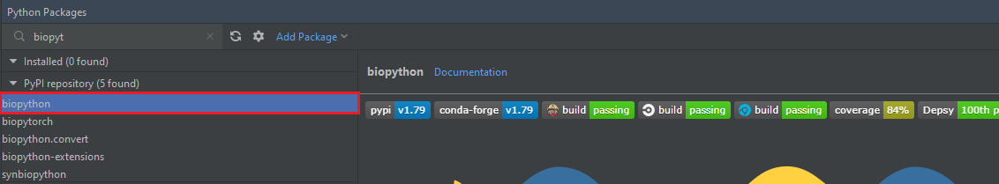
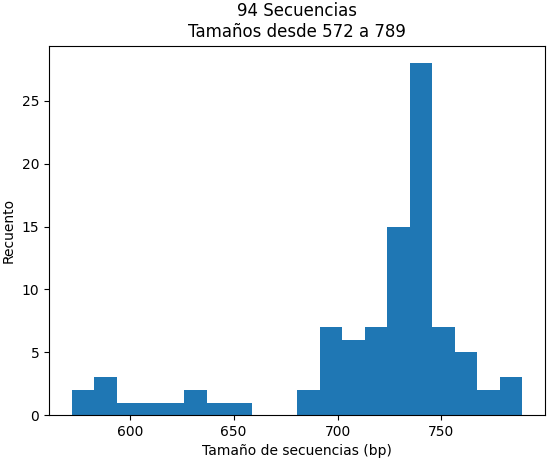
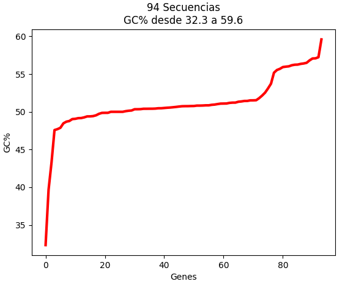

## **¿Qué es Biopython?**
[Biopython](https://biopython.org/) es el paquete de Python más utilizado en el ámbito de la biología computacional, con una gran cantidad de herramientas útiles en bioinformática. 

Esta librería fue creada en el año 1999 por _Brad Chapman_ y _Jeff Chang_, y actualmente está soportada por el _Proyecto Biopython_, una asociación de desarrolladores de herramientas en el lenguaje informático Python.

<figure markdown>
  { width="350" height="350" }
</figure>

### ***Ventajas***

* ^^Compatibilidad con diferentes formatos.^^ Biopython permite el tratamiento de archivos en diversos formatos utilizados en el ámbito biológico, presentando total compatibilidad con los archivos procedentes de GenBank, PDB, PubMed, ExPASy...
* ^^Tratamiento de secuencias.^^ Permite trabajar con secuencias tanto nucleotídicas como aminoacídicas.
* ^^Herramientas incorporadas.^^ Herramientas para realizar operaciones comunes en secuencias, como traducción, transcripción, longitud de cadenas...
* ^^Herramientas para realizar alineamientos de secuencias.^^
* ^^Amplio uso.^^ Al ser el paquete más utilizado en biología computacional junto a [Bioconductor](https://www.bioconductor.org/), encontrará una gran cantidad de foros actualizados que le serán de ayuda. Además se incluyen herramientas nuevas que le pueden ser de utilidad, así como actualizaciones de las herramientas anteriores.

Como bioquímico interesado en la bioinformática, es fundamental que se familiarice con Biopython, ya que es una herramienta fundamental actualmente en el lenguaje Python para el tratamiento de datos biológicos.

### ***Instalación***
En primer lugar debe instalar el paquete _biopython_. Para ello, como se explicó en el apartado [PyCharm](3_Pycharm.md), vaya a la ventana de _Python Packages_ e instálelo.

<figure markdown>

  { width="800" height="500" }
    <figcaption> Instalación del paquete *biopython* </figcaption>
</figure>

Otra opción sería utilizar el siguiente comando en la consola:
```
pip install biopython
```

## **Trabajo con secuencias**
Sin duda los elementos u objetos centrales en el tratamiento de datos biológicos son las **secuencias**. 

En este apartado aprenderá algunos conceptos básicos sobre el maneja del **objeto _Seq_**, objeto más utilizado en el paquete Biopython, que contiene muchas funciones en común con las cadenas. 

### ***Ejemplos ***
``` py linenums="1"
from Bio.Seq import Seq
seq = Seq("AGAGCCGACTTTACT")

num_nucleotidos= len(seq) #Almacena el número de nucleótidos

primer_nucleotido= seq[0] #Almacena el primer nucleótido

num_guaninas = seq.count("G") #Almacena el número de guaninas

cortar_secuencia= seq[0:6] #Almacena la secuencia desde el primer nucleótido hasta el séptimo

cadena_complementaria= seq[::-1] #Almacena la cadena complementaria

#Porcentaje de G+C
porcentaje_GC = 100 * float(seq.count("G") + seq.count("C")) / len(seq)

#Biopython ya contiene un módulo integrado que simplifica esta tarea
from Bio.SeqUtils import GC
calculo_porcentaje_GC= GC(seq)
```

### ***Transcripción y traducción***
En primer lugar veamos cómo realizar una **transcripción** en Biopython. Para esto crearemos objetos _Seq_ para la hebra de ADN codificante y la hebra molde/template:
``` py linenums="1"
from Bio.Seq import Seq
seq_codificante = Seq("AATGCGGCTTAACCACAC")
print(seq_codificante)
seq_molde = seq_codificante.reverse_complement()
print(seq_molde)
```
Debe tener en cuenta que la secuencia molde es leída por la polimerasa en dirección 3'-5', por lo que la secuencia codificante aparece en dirección 5'-3'. Por tanto se muestra por pantalla la siguiente salida:
``` py 
AATGCGGCTTAACCACAC
GTGTGGTTAAGCCGCATT
```
Una vez hemos creado la hebra molde y la codificante, vamos a llevar a cabo la transcripción. Recuerde que la transcripción se puede ver como la sustitución de A->U en la hebra codificante.
``` py linenums="1"
from Bio.Seq import Seq
seq_codificante = Seq("AATGCGGCTTAACCACAC")
seq_molde = seq_codificante.reverse_complement()
ARN_mensajero = seq_codificante.transcribe()
print(ARN_mensajero)
```
Si únicamente posee la hebra molde, y desea realizar la transcripción sin necesidad de crear la hebra codificante, puede utilizar la acción combinada de ambas funciones anteriores:
``` py linenums="1"
from Bio.Seq import Seq
seq_molde = Seq("GTGTGGTTAAGCCGCATT")
ARN_mensajero = seq_molde.reverse_complement().transcribe()
```
Por último, si lo que desea es realizar una transcripción inversa, es decir, pasar del ARN mensajero a la hebra codificante:
``` py linenums="1"
from Bio.Seq import Seq
ARN_mensajero = Seq("AAUGCGGCUUAACCACAC")
seq_codificante = ARN_mensajero.back_transcribe()
```
Una vez finalizada la transcripción, veamos cómo llevar a cabo la **traducción** partiendo de la secuencia nucleotídica del ARN mensajero obtenida.
``` py linenums="1"
from Bio.Seq import Seq
seq_codificante = Seq("AATGCGGCTTTACCACAC")
seq_molde = seq_codificante.reverse_complement()
ARN_mensajero = seq_codificante.transcribe()

proteina= ARN_mensajero.translate()
print(proteina)
```
Esto debería mostrar por pantalla la siguiente secuencia aminoacídica:
``` py 
NAALPH
```
También podría realizar la traducción desde la hebra codificante de ADN. En este caso se ha introducido una mutación en la secuencia: T 11 -> A 11.  
``` py linenums="1"
from Bio.Seq import Seq
seq_codificante = Seq("AATGCGGCTTAACCACAC")
seq_molde = seq_codificante.reverse_complement()

proteina= seq_codificante.translate()
print(proteina)
```
En este caso, el resultado será el siguiente:
``` py 
NAA*PH
# El asterisco indica que es un codón stop.
```
Aunque a priori parece un método muy básico, hay algunos **aspectos adicionales** en la traducción que hay que tener en cuenta.

La tabla de traducción que utiliza Biopython se basa en la tablas indicadas en el [NCBI](https://www.ncbi.nlm.nih.gov/Taxonomy/Utils/wprintgc.cgi), utilizando de forma predeterminada el código genético estándar (_Tabla 1_). En algunos casos necesitará utilizar tablas de traducción diferente, por ejemplo si está tratando con un genoma mitocondrial. Esto se puede indicar de diversas formas:
``` py linenums="1"
from Bio.Seq import Seq
seq_codificante = Seq("AATGCGGCTTAACCACAC")
seq_molde = seq_codificante.reverse_complement()

proteina= seq_codificante.translate(table="Vertebrate Mitochondrial") #1ª Forma
proteina= seq_codificante.translate(table=2) # 2ª Forma
```
Como ha visto en uno de los ejemplos anteriores, Biopython va a detectar un codón de parada indicándolo con un asterisco. Lo normal es que desee llevar a cabo la traducción hasta este codón y detenerse:
``` py linenums="1"
from Bio.Seq import Seq
seq_codificante = Seq("AATGCGGCTTAACCACAC")
seq_molde = seq_codificante.reverse_complement()

proteina= seq_codificante.translate(to_stop=True)
print(proteina)
```

## **Trabajo con archivos**
Para trabajar con distintos formatos de archivos de secuencias, el módulo más utilizado en BioPython es [Bio.seqIO](https://biopython.org/wiki/SeqIO). 

Para poder aprender a trabajar con archivos, necesitaremos uno que se desee analizar. Tenga en cuenta las características de su ordenador, ya que si utiliza un genoma demasiado pesado este proceso puede llegar a ser muy lento o incluso interminable.

En este caso se propone como ejemplo los resultados en NCBI de una subfamilia de orquídea, [Cypripedioideae](https://www.ncbi.nlm.nih.gov/data-hub/taxonomy/158330/), utilizado en formato .fasta: [orquidea.fasta](ls_orchid.fasta). 

### ***Lectura de archivos de secuencia***
Para leer archivos de secuencia la función más utilizada es _Bio.SeqIO.parse()_. Esta función, utilizada normalmente en un bucle _for_, necesita dos argumentos:

* Nombre del fichero que se desea leer.
* Indicador del tipo de archivo que se desea leer, en letras minúsculas.

``` py linenums="1"
from Bio import SeqIO

for seq_record in SeqIO.parse("ls_orchid.fasta", "fasta"):
    print(seq_record.id)  #Devuelve el ID identificador
    print(repr(seq_record.seq))  #Devuelve la secuencia
    print(len(seq_record))  #Devuelve la longitud de la secuencia
```
Deberá haber obtenido un resultado similar al siguiente:
```  
gi|2765658|emb|Z78533.1|CIZ78533
Seq('CGTAACAAGGTTTCCGTAGGTGAACCTGCGGAAGGATCATTGATGAGACCGTGG...CGC')
740
gi|2765657|emb|Z78532.1|CCZ78532
Seq('CGTAACAAGGTTTCCGTAGGTGAACCTGCGGAAGGATCATTGTTGAGACAACAG...GGC')
753
...
...
gi|2765564|emb|Z78439.1|PBZ78439
Seq('CATTGTTGAGATCACATAATAATTGATCGAGTTAATCTGGAGGATCTGTTTACT...GCC')
592
```
!!! info "Lectura de otros formatos de archivo"

    Si en lugar de leer un archivo en formato .fasta, desea leer cualquier otro archivo únicamente tiene que cambiar el valor del segundo argumento.

    Por ejemplo, si desea leer un archivo .gbk (procedente de GenBank): "fasta" -> "genbank". 

    En el siguiente [enlace](https://biopython.org/wiki/SeqIO) puede encontrar una tabla con todas las opciones.

    En muchos casos trabajará con archivos gzip, muy utilizados por herramientas bioinformáticas. Puede informarse sobre el [módulo gzip](https://docs.python.org/3/library/gzip.html), aunque es tan simple como utilizar _gzip.open()_. 

Aunque esta opción de lectura le puede ser de uso, en muchas ocasiones deseará trabajar con cada lectura de forma individual. Para ello tiene que trabajar con este archivo como si fuera un objeto más, como se muestra a continuación:

``` py linenums="1"
from Bio import SeqIO

entradas = SeqIO.parse("ls_orchid.fasta", "fasta")

print("LA PRIMERA ENTRADA:")
primera_entrada = next(entradas)
print(primera_entrada.id)
print(primera_entrada.description)
print(len(primera_entrada))

print("LA SEGUNDA ENTRADA:")
segunda_entrada = next(entradas)
print(segunda_entrada.id)
print(segunda_entrada.description)
print(len(segunda_entrada))
```

### ***Extracción y escritura de datos***
El archivo fasta utilizado de ejemplo empieza de la siguiente forma:
``` 
>gi|2765658|emb|Z78533.1|CIZ78533 C.irapeanum 5.8S rRNA gene and ITS1 and ITS2 DNA
CGTAACAAGGTTTCCGTAGGTGAACCTGCGGAAGGATCATTGATGAGACCGTGGAATAAACGATCGAGTG
....
```
Como puede comprobar, el nombre de la especie (_C. irapeanum_) es el segundo argumento en la descripción, información que podemos utilizar para obtener el nombre de todas las especies:
``` py linenums="1"
from Bio import SeqIO

especies = []
for seq_record in SeqIO.parse("ls_orchid.fasta", "fasta"):
    especies.append(seq_record.description.split()[1])
print(especies)
```
Esto te devuelve por pantalla la siguiente lista:
``` 
['C.irapeanum', 'C.californicum', 'C.fasciculatum', 'C.margaritaceum', 'C.lichiangense',...]
```
Aun así, como sabe los archivos fasta no son excesivamente útiles en el aspecto de extracción de información, por lo que le recomendamos que pruebe este método con archivos de EMBL o GenBank.

La modificación de datos en el archivo es muy simple. Veamos como modificar por ejemplo el ID de la primera entrada:
``` py linenums="1"
from Bio import SeqIO
entradas = SeqIO.parse("ls_orchid.fasta", "fasta")
primera_entrada = next(entradas)
print(primera_entrada)

primera_entrada.id = "ID_NUEVO"
print(primera_entrada)
```

## **Graficación**
En este apartado se muestran algunos ejemplos de gráficas utilizando la librería _matplotlib_ junto al módulo _Bio.SeqIO_. Para ello se va a utilizar de nuevo el archivo [orquidea.fasta](ls_orchid.fasta).

***HISTOGRAMA***

Veamos cómo realizar un histograma que compare las longitudes de las secuencias en un rango de tamaños. En primer lugar, necesitamos almacenar en una lista la longitud de todas las secuencias:
``` py linenums="1"
from Bio import SeqIO
longitudes = [len(rec) for rec in SeqIO.parse("ls_orchid.fasta", "fasta")]

print(longitudes)
```
Ahora utilizaremos la librería _matplotlib_ para poder representarlos.
``` py linenums="1"
from Bio import SeqIO
from matplotlib import pylab

longitudes = [len(rec) for rec in SeqIO.parse("ls_orchid.fasta", "fasta")]

pylab.hist(longitudes, bins=20)
pylab.title(
    "%i Secuencias\nTamaños desde %i a %i" % (len(longitudes), min(longitudes), max(longitudes))
)
pylab.xlabel("Tamaño de secuencias (bp)")
pylab.ylabel("Recuento")
pylab.show()
```

<figure markdown>
  { width="450" height="450" }
</figure>

***FIGURA DE LÍNEAS***

Para mostrar un ejemplo de un gráfico de líneas, la mejor opción es representar una de las gráficas que más utilizará: **representación GC%**.

En primer lugar necesitamos una lista con los porcentajes GC de las secuencias, utilizando el _módulo GC_ empleado al principio de esta página.

``` py linenums="1"
from Bio import SeqIO
longitudes = [len(rec) for rec in SeqIO.parse("ls_orchid.fasta", "fasta")]

print(longitudes)
```

Una vez obtenida la lista, representamos:
``` py linenums="1"
from Bio import SeqIO
from Bio.SeqUtils import GC
from matplotlib import pylab

valores_GC = sorted(GC(rec.seq) for rec in SeqIO.parse("ls_orchid.fasta", "fasta"))
pylab.plot(valores_GC, linewidth= 3, color= "red")
pylab.title(
    "%i Secuencias\nGC%% desde %0.1f a %0.1f"
    % (len(valores_GC), min(valores_GC), max(valores_GC))
)
pylab.xlabel("Genes")
pylab.ylabel("GC%")
pylab.show()
```

<figure markdown>
  { width="450" height="450" }
</figure>

## **Blast**
[Blast](https://blast.ncbi.nlm.nih.gov/Blast.cgi) (_Basic Local Alignment Search Tool_) es una herramienta informática de alineamiento de secuencias local, tanto de ácidos nucleicos como de secuencias proteicas. 

* ^^Blastn^^. Nucleótido > nucleótido.
* ^^Blastp^^. Proteína > proteína.
* ^^Tblastn^^. Proteína > secuencia nucleotídica traducida.
* ^^Blastx^^. Secuencia nucleotídica traducida > proteína.

Esta herramienta, sin duda una de las más importantes en bioinformática, está disponible desde Biopython con el [módulo Bio.blast.NCBIWWW](https://biopython.org/docs/1.75/api/Bio.Blast.NCBIWWW.html). 

La función _qblast()_ en el módulo _Bio.blast.NCBIWWW necesita tres argumentos:

* **Primer argumento**. Programa blast que usará: blastn, blastp...
* **Segundo argumento**. Base de datos en la que basará la búsqueda. Ej. _Nucleotide database (nt)_.
* **Tercer argumento**. Una cadena que contenga tu secuencia de entrada (query sequence). Si la secuencia la tiene en un archivo fasta, simplemente almacénela como una cadena.

Aunque estos son los argumentos principales y necesarios para su funcionamiento, _qblast()_ tiene muchos más argumentos y parámetros disponibles para modificar. Al igual que con todas las funciones, puede informarse en:
``` py linenums="1"
from Bio.Blast import NCBIWWW
help(NCBIWWW.qblast)
```
### ***Ejemplo práctico***

En primer lugar descárguese un archivo fasta en su directorio de trabajo. Le proponemos como ejemplo el siguiente [fasta](NAC_solanum_arabidopsis.fasta), la secuencia codificante del gen NAC de _Solanum lycopersicum_ y de _Arabidopsis thaliana_.

Importe el _módulo NCBIWWW_ y asigne la secuencia fasta a una variable.

``` py linenums="1"
from Bio.Blast import NCBIWWW
archivo_fasta = open("NAC_solanum_arabidopsis.fasta").read()
```
``` 
>>> archivo_fasta
>NC_015441.3:2856617-2858593 Solanum lycopersicum cultivar Heinz 1706 chromosome 4, SL3.0, whole genome shotgun sequence
GTCAAAGAAACTGAAACTAACACAAAGCAGGAGCAGGAGCAGCAACAAACAGAGAGAAGAAAACAGAGGA
AGATAAGAGGAAAATTTATCGAATTCGAATCGAGAGAAAAGGGGAAGTGAA ....

>NC_003070.9:c11867154-11865229 Arabidopsis thaliana chromosome 1 sequence
GTCAAAGAAACTGAAACTAACACAAAGCAGGAGCAGGAGCAGCAACAAACAGAGAGAAGAAAACAGAGGAAGATA
GAGTCCTACCACCATTATAAATTATCTCATCGTTTGCTTTCTTTTTTTTAA ....
```

Utilice la función _qblast()_ con los parámetros indicados anteriormente, como a continuación:
``` py linenums="1"
from Bio.Blast import NCBIWWW
archivo_fasta = open("NAC_solanum_arabidopsis.fasta").read()
resultados = NCBIWWW.qblast("blastn", "nt", archivo_fasta)
```
Guarde el objeto _resultados_ a un archivo .xml que puede ser analizado.
``` py linenums="1"
from Bio.Blast import NCBIWWW
archivo_fasta = open("NAC_solanum_arabidopsis.fasta").read()
resultados = NCBIWWW.qblast("blastn", "nt", archivo_fasta)

with open('results.xml', 'w') as save_file:
    blast_results = resultados.read()
    save_file.write(blast_results)
```
Tras esto, habrá obtenido el siguiente archivo [xml](results.xml). Tenga en cuenta que el análisis con Biopython de los resultados del Blast también le puede ser útil para resultados obtenidos en un Blast online.
``` py linenums="1"
from Bio.Blast import NCBIWWW
from Bio.Blast import NCBIXML

resultado = open("results.xml", 'r')
registro_blast = NCBIXML.parse(resultado)
registro_blast = next(registro_blast)

E_VALUE_THRESH = 0.04
for alignment in registro_blast.alignments:
    for hsp in alignment.hsps:
        if hsp.expect < E_VALUE_THRESH:
            print("****Alineamiento****")
            print("Secuencia:", alignment.title)
            print("Tamaño:", alignment.length)
            print("e-value:", hsp.expect)
            print(hsp.query[0:75] + "...")
            print(hsp.match[0:75] + "...")
            print(hsp.sbjct[0:75] + "...")
```
Esto le dará como resultado el siguiente análisis Blast. A partir de este análisis puede realizar diferentes acciones, encontrando más información en el siguiente [enlace](https://biopython-tutorial.readthedocs.io/en/latest/notebooks/07%20-%20Blast.html) a mayor información. 
```  
****Alineamiento****
Secuencia: gi|1273855477|gb|CP023760.1| Solanum lycopersicum cultivar I-3 chromosome 4
Tamaño: 66477049
e-value: 0.0
GTCAAAGAAACTGAAACTAACACAAAGCAGGAGCAGGAGCAGCAACAAACAGAGAGAAGAAAACAGAGGAAGATA...
|||||||||||||||||||||||||||||||||||||||||||||||||||||||||||||||||||||||||||...
GTCAAAGAAACTGAAACTAACACAAAGCAGGAGCAGGAGCAGCAACAAACAGAGAGAAGAAAACAGAGGAAGATA...

****Alineamiento****
Secuencia: gi|1273855477|gb|CP023760.1| Solanum lycopersicum cultivar I-3 chromosome 4
Tamaño: 66477049
e-value: 1.44242e-12
GGTGAAAAAGAGTGGTATTTTTTCTCACCAAGGGATAGAAAATATCCGAACGGTTCACGGCCGAACCGAGCAGCA...
|| |||||||| |||||||| ||| | ||| | |||||||||||||| || |||    |||| ||  | ||||| ...
GGAGAAAAAGAATGGTATTTCTTCACCCCACGTGATAGAAAATATCCAAATGGTGTTAGGCCAAATAGGGCAGCT...

****Alineamiento****
Secuencia: gi|1273855477|gb|CP023760.1| Solanum lycopersicum cultivar I-3 chromosome 4
Tamaño: 66477049
e-value: 4.71528e-06
AACACAACTTCAAATCTCAAAAA-TCACAATTTCAAAAACTCATAGATTTCAACT------TCTATATTCAAACA...
|| ||||| |||||  | ||||| || ||| |||||||||||| || ||||||||      |||||  |||||||...
AAAACAACATCAAAGTTAAAAAAATCGCAACTTCAAAAACTCAAAG-TTTCAACTTCGAAATCTATGATCAAACA...

...
```


## **Archivos de lecturas**
