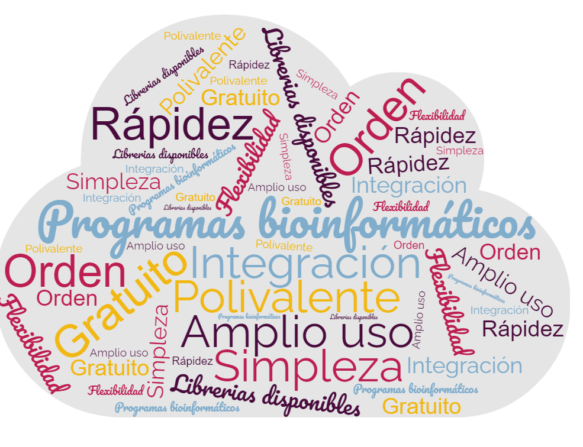

## **¿Qué es Python?**
Python es un lenguaje de programación potente y fácil de aprender, creado por *Guido van Rossum* en 1990, aunque actualmente es desarrollado y mantenido por la [Python Software Foundation](https://www.python.org/psf-landing/). Este lenguaje de programación multiparadigma permite: 

* Programación imperativa. 
* Programación funcional. 
* Programación orientada a objetos.

A diferencia de otros lenguajes como Java o .NET, se trata de un lenguaje interpretado, es decir, no es necesario compilarlo para ejecutar las aplicaciones escritas en Python, sino que se ejecutan directamente por el ordenador utilizando un programa denominado intérprete. 

## **Características**
Las principales características de Python son las siguientes:

* Multiparadigma.
* Multiplataforma. Se puede encontrar un intérprete de Python para los principales sistemas operativos (Windows, Linux y Mac OS), utilizándose el mismo código en cada una de las plataformas.
* Interpretado. El código no se compila. 
* Dinámicamente tipado y fuertemente tipado. Esto significa que el tipo de los objetos se decide en tiempo de ejecución, y que el tipo de valor no cambia repentinamente.

## **Instalación**
Como se ha comentado, Python presenta soporte multiplataforma, y su instalación es muy similar en Windows y MacOs. En una distribución estándar Linux dispone por defecto del interprete Python.  

Python permite tener instaladas distintas versiones, por ejemplo, *Python 3.9* y *Python 3.10*. Al no tener conocimientos avanzados, se recomienda tener instalada únicamente una versión de Python, la más reciente (*3.10*). En concreto, la última versión de Python disponible es la *3.10.2*, lanzada el día 14 de enero de 2022. 

* **Enlace**: página oficial para la descarga de [Python 3.10.2](https://www.python.org/downloads/)

**ETAPAS**

1. Una vez descargado el instalador, inicie la instalación (haciendo doble click).
2. En la primera pantalla, se pueden modificar las opciones de instalación en el cuadro *Customize installation*. El usuario puede utilizarlo, pero en principio no va a ser necesario. Sí será útil seleccionar la opción *Add Python 3.10 to PATH*, fundamental para usar la línea de comandos para ejecutar programas. Una vez seleccionado, siga adelante mediante la opción *Install Now*.
3. A continuación, se realiza la instalación. Sea paciente, puede durar unos cuantos minutos.
4. Finalmente cierre el programa de instalación en la opción *Close*. 

## **Primer programa: Hola Mundo**

{: style="height:150px;width:150px"}

