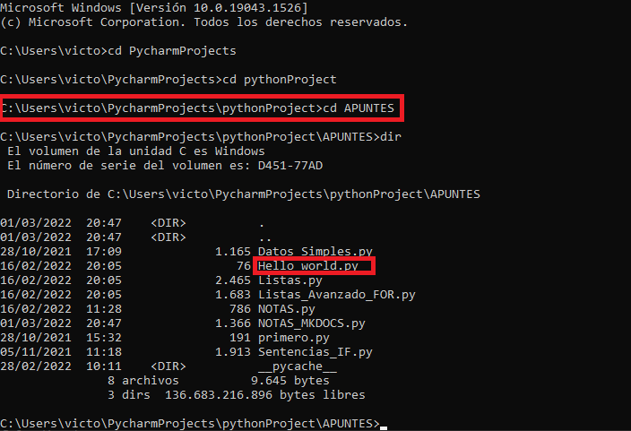
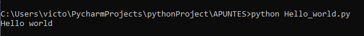

## **¿Qué es Python?**
Python es un lenguaje de programación potente y fácil de aprender, creado por *Guido van Rossum* en 1990, aunque actualmente es desarrollado y mantenido por la [Python Software Foundation](https://www.python.org/psf-landing/). Este lenguaje de programación multiparadigma permite: 

* Programación imperativa. 
* Programación funcional. 
* Programación orientada a objetos.

A diferencia de otros lenguajes como Java o .NET, se trata de un lenguaje interpretado, es decir, no es necesario compilarlo para ejecutar las aplicaciones escritas en Python, sino que se ejecutan directamente por el ordenador utilizando un programa denominado intérprete. 

## **Características**
Las principales características de Python son las siguientes:

* ^^Multiparadigma^^.
* ^^Multiplataforma^^. Se puede encontrar un intérprete de Python para los principales sistemas operativos (Windows, Linux y MacOS), utilizándose el mismo código en cada una de las plataformas.
* ^^Interpretado^^. El código no se compila. 
* ^^Dinámicamente tipado y fuertemente tipado^^. Esto significa que el tipo de los objetos se decide en tiempo de ejecución, y que el tipo de valor no cambia repentinamente.

<figure markdown>

  { width="500" height="300" }

</figure>

## **Instalación**
Como se ha comentado, Python presenta soporte multiplataforma, y su instalación es muy similar en Windows y MacOs. En una distribución estándar Linux dispone por defecto del interprete Python.  

Python permite tener instaladas distintas versiones, por ejemplo, *Python 3.9* y *Python 3.10*. Al no tener conocimientos avanzados, se recomienda tener instalada únicamente una versión de Python, la más reciente (*3.10*). En concreto, la última versión de Python disponible es la *3.10.2*, lanzada el día 14 de enero de 2022. 

!!! info "ENLACE PYTHON 3.10.2"

    El siguiente enlace le redirige a la página oficial de Python para la descarga de [Python 3.10.2](https://www.python.org/downloads/)


<center>
**ETAPAS**
</center>

1. Una vez descargado el instalador, inicie la instalación (haciendo doble click).
2. En la primera pantalla, se pueden modificar las opciones de instalación en el cuadro *Customize installation*. El usuario puede utilizarlo, pero en principio no va a ser necesario. Sí será útil seleccionar la opción *Add Python 3.10 to PATH*, fundamental para usar la línea de comandos para ejecutar programas. Una vez seleccionado, siga adelante mediante la opción *Install Now*.
3. A continuación, se realiza la instalación. Puede durar unos cuantos minutos.
4. Finalmente cierre el programa de instalación en la opción *Close*. ¡Ya tiene descargado Python! :smile: 


## **Primer programa**
Para comprobar que se ha instalado correctamente Python en su ordenador, vamos a ejecutar un programa simple: *Hola Mundo*.
Este programa se suele usar de forma genérica en informática como introducción al estudio de un lenguaje de programación determinado. 

Hay que crear en un directorio determinado, como puede ser *Python_Projects*. Dentro de este directorio crearemos un archivo denominado ***hola_mundo.py***, como se muestra a continuación:
``` py title="hola_mundo.py"
print("Hola Mundo!!!")
```

!!! note "Nombres de Archivos"

    Como se puede observar, el nombre del archivo es *hola_mundo* y no *hola_mundo*. En general, se recomienda que los archivos de programa estén escritos de forma clara y utilizando guiones bajos para separar números o palabras. El nombre del archivo debe ser representetativo del programa que codifica.


Una vez creado el programa, vamos a ejecutarlo en la terminal. La ejecución es similar en todos los sistemas operativos: se debe acceder desde la terminal al directorio que contiene el programa, y una vez allí ejecutarlo. A continuación se pone de ejemplo la ejecución en Windows:

1. Abrir la terminal.
    * Buscar *terminal* en el buscador de Windows o Cortana.
    * Abrir el menú Inicio - Ejecutar - cmd. 
2. Utilizar el comando ***cd*** (permite cambiar de directorio) hasta entrar en el directorio en el que se encuentra el archivo.
<figure markdown>

  { width="500" height="300" }
   <figcaption>Se puede observar la ruta hasta el archivo: *C:\Users\victo\PycharmProjects\pythonProject\APUNTES* </figcaption>
</figure>

Se ha utilizado el comando ***dir*** para visualizar el contenido de ese directorio (comando similar a *ls* en Linux y MacOs).  Por último, ejecutamos el programa: ***python hola_mundo.py***
<figure markdown>

  { width="500" height="300" }
</figure>


