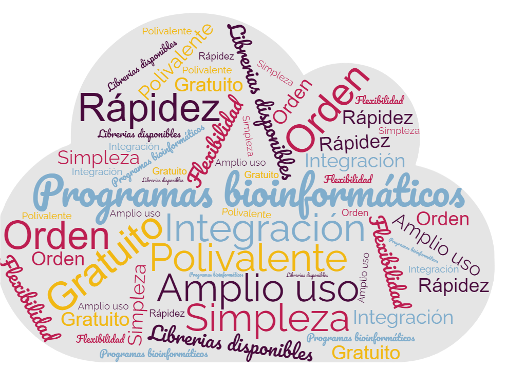

## **¿Qué es Python?**
Python es un lenguaje de programación potente y fácil de aprender, creado por *Guido van Rossum* en 1990, aunque actualmente es desarrollado y mantenido por la [Python Software Foundation](https://www.python.org/psf-landing/). Este lenguaje de programación multiparadigma permite: 

* Programación imperativa. 
* Programación funcional. 
* Programación orientada a objetos.

A diferencia de otros lenguajes como Java o .NET, se trata de un lenguaje interpretado, es decir, no es necesario compilarlo para ejecutar las aplicaciones escritas en Python, sino que se ejecutan directamente por el ordenador utilizando un programa denominado intérprete. 

## **Características**
Las principales características de Python son las siguientes:

* ^^Multiparadigma^^.
* ^^Multiplataforma^^. Se puede encontrar un intérprete de Python para los principales sistemas operativos (Windows, Linux y MacOS), utilizándose el mismo código en cada una de las plataformas.
* ^^Interpretado^^. El código no se compila. 
* ^^Dinámicamente tipado y fuertemente tipado^^. Esto significa que el tipo de los objetos se decide en tiempo de ejecución, y que el tipo de valor no cambia repentinamente.

<figure markdown>

  { width="500" height="300" }

</figure>

## **Instalación**
Como se ha comentado, Python presenta soporte multiplataforma, y su instalación es muy similar en Windows y MacOs. Python viene instalado en la mayoría de los sistemas MacOs y Linux, pero muy probablemente se trate de una versión desfasada, por lo que conviene comprobar de qué versión se trata.  

Python permite tener instaladas distintas versiones, por ejemplo, *Python 3.9* y *Python 3.10*. Al no tener conocimientos avanzados, se recomienda tener instalada únicamente una versión de Python, la más reciente (*3.10*). En concreto, la última versión de Python disponible es la *3.10.2*, lanzada el día 14 de enero de 2022. 

!!! info "ENLACE PYTHON 3.10.2"

    El siguiente enlace le redirige a la página oficial de Python para la descarga de [Python 3.10.2](https://www.python.org/downloads/)

### ***Linux***

En primer lugar, abra la terminal.

   * Ctrl + Alt + T
   * Buscar *terminal* en el tablero o Dash.

Para comprobar la versión, se proponen tres formas diferentes:
```
python -V
```
```
python --version
```
La última opción sería ejecutar *python3* en la terminal, que producirá una salida como esta:
```
python 3.5.6 (default, Feb 2021, 22:59:56) 
[GCC 4.8.2] on linux2 
Type "help", "copyright", "credits" or "license" for more information. 
>>>
```

Una vez comprobada la versión, si desea instalar la versión más reciente, utilizaremos un paquete llamada ^^*deadsnakes*^^, que actualizará el listado de paquetes disponibles de Python más recientes. Para salir del intérprete de Python, pulse *Control-D* o escriba el comando *exit()*. Introduzca posteriormente los siguientes comandos:

```
$ sudo add-apt-repository ppa:deadsnakes/ppa
$ sudo apt-get update
$ sudo apt install python3.10
```
!!! note "Fallo en la actualización"

    Si no ha conseguido actualizar Python, compruebe previamente que la lista de paquetes disponibles está actualizada. Introduzca en el terminal *$ sudo apt update*. 


Estos comandos deberían instalar la última versión de Pyhton en su sistema. Para asegurarse que cuando ejecuta Python lo hace en la versión 3.10, aconstrúmbase a ejecutarlo de la siguiente forma.

```
$ python3.10
```


### ***MacOS***
En primer lugar, abra una ventana del terminal:

 * Aplicaciones > Utilidades > Terminal.
 * Comando-Barra Espaciadora + Terminal.

Para comprobar la versión, se proponen tres formas diferentes:
```
python -V
```
```
python --version
```
La última opción sería ejecutar *python* en la terminal, que producirá una salida como esta:
```
python 3.5.6 (default, Feb 2021, 22:59:56) 
[GCC 4.8.2 Compatible Apple LLVM 9.1.0 (clang-902.0.39.2)] on darwin 
Type "help", "copyright", "credits" or "license" for more information. 
>>>
```

Una vez comprobada la versión, si desea instalar la versión más reciente, tiene que descargar el instalador para su sistema, y seguir las etapas que aparecen en el apartado *Windows - Etapas*. 

Cuando haya finalizado, ya puede empezar una sesión de terminal de Python con el siguiente comando. 
```
$ python3
```

Asegúrese de utilizar este comando para que se ejecute la versión de Python que acaba de instalar, ya que podría ejecutar sino *Python2*, con el que podría tener problemas si intenta utilizar los códigos que aparecen en este tutorial.

### ***Windows***
#### ***Etapas***

1. Una vez descargado el instalador, inicie la instalación (haciendo doble click).
2. En la primera pantalla, se pueden modificar las opciones de instalación en el cuadro *Customize installation*. El usuario puede utilizarlo, pero en principio no va a ser necesario. Sí será útil seleccionar la opción *Add Python 3.10 to PATH*, fundamental para usar la línea de comandos para ejecutar programas. Una vez seleccionado, siga adelante mediante la opción *Install Now*.
3. A continuación, se realiza la instalación. Puede durar unos cuantos minutos.
4. Finalmente cierre el programa de instalación en la opción *Close*. ¡Ya tiene descargado Python! :smile: 


#### ***Ejecutar Python en el terminal***
Una vez instalado Python, para comprobar que se ha realizado correctamente, vamos a ejecutarlo desde la terminal.

1. Abrir una sesión de terminal.
    * Buscar *terminal* en el buscador de Windows o Cortana.
    * Abrir el menú Inicio - Ejecutar - cmd. 
2. Escribir *python* en minúscula. Deberia aparecer por pantalla un mensaje similar:
<figure markdown>

  { width="700" height="400" }
   
</figure>

Una vez abierto, Python nos permite realizar diferentes acciones: desde realizar operaciones matemáticas hasta mostrar mensajes por pantalla.
```  
>>> print("¡Es un placer conocerte!")
¡Es un placer conocerte!
>>>
```


## **Ejecutar programas de Python desde el terminal**
En el siguiente punto se verán los posibles editores de texto, donde se ejecutarán la mayoría de los programas. A veces, puede resultar útil ejecutar programas desde el terminal, como en aquellos casos en los que una limitación de memoria RAM hagan que desee ejecutar un programa sin tener que abrir el editor (que implica mayor consumo).

Para esto, es fundamental que conozca el directorio en el que se almacena dicho programa. A continuación, se muestra un ejemplo de una ejecución desde el terminal, creando previamente tanto el directorio como el archivo de texto a ejecutar. 

### ***Hello World***
Vamos a ejecutar un programa simple: *Hola Mundo*.
Este programa se suele usar de forma genérica en informática como introducción al estudio de un lenguaje de programación determinado. 

Hay que crear en un directorio determinado, como puede ser *Python_Projects*, recomendándose practicar este tutorial siempre en el mismo directorio. Dentro de este directorio crearemos un archivo de texto plano denominado ***hola_mundo.py***, como se muestra a continuación:
``` py title="hola_mundo.py"
print("Hola Mundo!!!")
```

!!! note "Nombres de Archivos"

    Como se puede observar, el nombre del archivo es *hola_mundo* y no *hola mundo*. En general, se recomienda que los archivos de programa estén escritos de forma clara y utilizando guiones bajos para separar números o palabras. El nombre del archivo debe ser representetativo del programa que codifica.


Una vez creado el programa, vamos a ejecutarlo en la terminal. La ejecución es similar en todos los sistemas operativos: se debe acceder desde la terminal al directorio que contiene el programa, y una vez allí ejecutarlo. A continuación se pone de ejemplo la ejecución en Windows:

1. Abrir la terminal.

2. Utilizar el comando ***cd*** (permite cambiar de directorio) hasta entrar en el directorio en el que se encuentra el archivo.
<figure markdown>

  { width="500" height="300" }
   <figcaption>Se puede observar la ruta hasta el archivo: *C:\Users\victo\PycharmProjects\pythonProject\* </figcaption>
</figure>

Se ha utilizado el comando ***dir*** para visualizar el contenido de ese directorio (comando similar a *ls* en Linux y MacOs).  Por último, ejecutamos el programa: ***python hola_mundo.py***
<figure markdown>

  { width="500" height="300" }
</figure>

A continuación se muestran algunos de los comandos básicos más importantes que pueden resultarle útiles a la hora de trabajar en la consola.

| WINDOWS      | LINUX             |      FUNCIÓN     | 
| :---------: | :----------------: |:---------: |
| `copy`       | `cp`             | Copiar un archivo |
| `move`       | `mv`              | Mover un archivo  |
| `dir`    | `ls`             | Lista de archivos |
| `del`       | `mv`              | Borrar archivos  |
| `md`    | `mkdir`             | Crear un directorio |
| `chdir`       | `pwd`              | Visualizar su posición actual  |
| `cd ruta`  | `cd ruta`             | Cambiar de directorio |

## **Editores de texto e IDE**
Para escribir, leer y editar código de la manera más eficiente posible, se necesita un editor de texto o un entorno de desarrollo integrado (IDE, *Integrated development environment*). 

Un IDE no deja de ser un editor de texto, pero que incluye otra serie de herramientas que le permiten examinar el código mientras se introduce y aprender sobre el mismo. Utilizar un IDE puede parecer abrumador para un principiante al comienzo, pero una vez se aconstumbre le será mucho más fácil escribir y leer código. Si se trabaja en un equipo que posea pocos recursos, un editor de texto simple puede ser mejor opción.

^^**[SUBLIME TEXT](https://www.sublimetext.com/)**^^ 

Sublime Text es un editor de texto avanzado que soporta multitud de lenguajes, como C, C++, HTML o LaTex. Es un programa de pago, la licencia individual cuesta unos 69$ aunque se puede descargar una versión de prueba que tiene tiempo ilimitado. No es una herramienta visual, sino un editor de texto clásico, destacando por su rapidez en la ejecución y su tamaño (7 Mbytes).  

<figure markdown>

  { width="150" height="100" }

</figure>

^^**[VISUAL STUDIO CODE](https://code.visualstudio.com/)**^^

Editor de texto que actúa de forma muy similar a un IDE. Desarrollado por Microsoft, este editor soporta el uso eficiente de un depurador, ofrece distintas herramientas de compleción de código e integra compatibilidad con control de versiones. Es uno de los más utilizados por la comunidad. 

<figure markdown>

  { width="140" height="100" }

</figure>

^^**[PYCHARM](https://www.jetbrains.com/es-es/pycharm/)**^^

PyCharm es un IDE muy popular desarrollado por la compañía *Jetbrains*, construído específicamente para programar en el lenguaje Python. La versión gratuita se denomina *PyCharm Community Edition*, y contiene una gran cantidad de herramientas y opciones disponibles. Integra un depurador que ayuda a resolver errores, autocompletado en la sintáxis, herramientas de prueba y debug; así como una terminal y consola Python, lo que lo convierte en uno de los mejores editores posibles.

<figure markdown>

  { width="150" height="100" }

</figure>

!!! cite "Enlaces de interés"

    * [**Documentación de Python 3.10.2**](https://docs.python.org/es/3/index.html)
    * [**Comandos Linux vs Windows**](https://networknuts.files.wordpress.com/2013/12/commands-win-linux-networknuts.png)
    * [**Editores de texto e IDE**](https://realpython.com/python-ides-code-editors-guide/)


