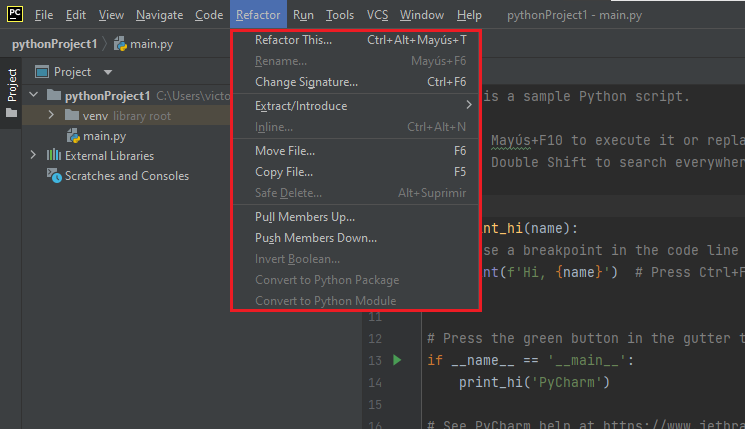
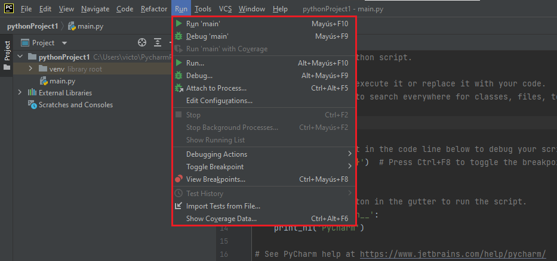
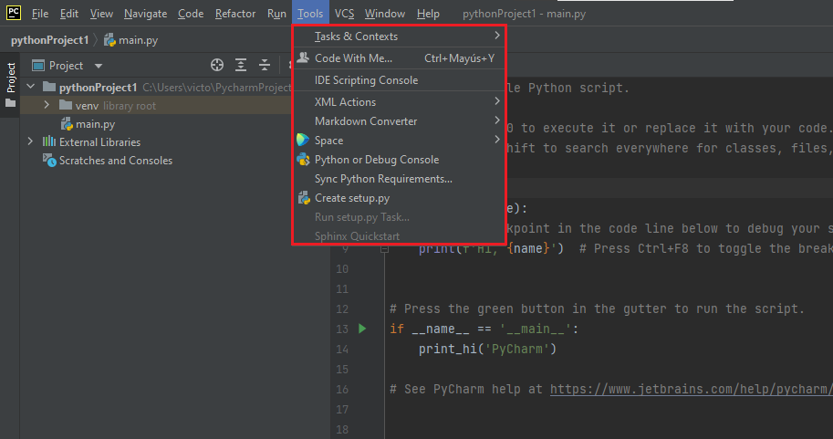
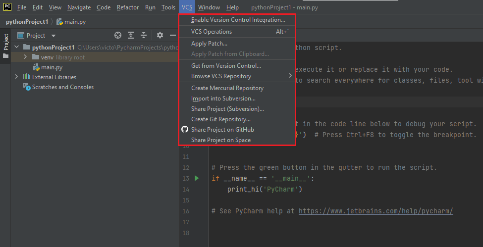
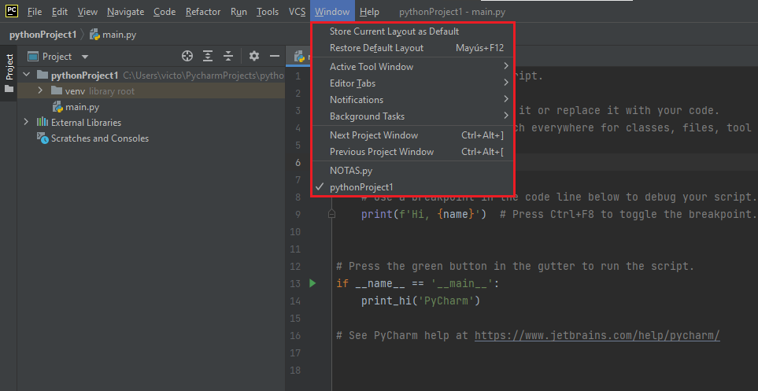
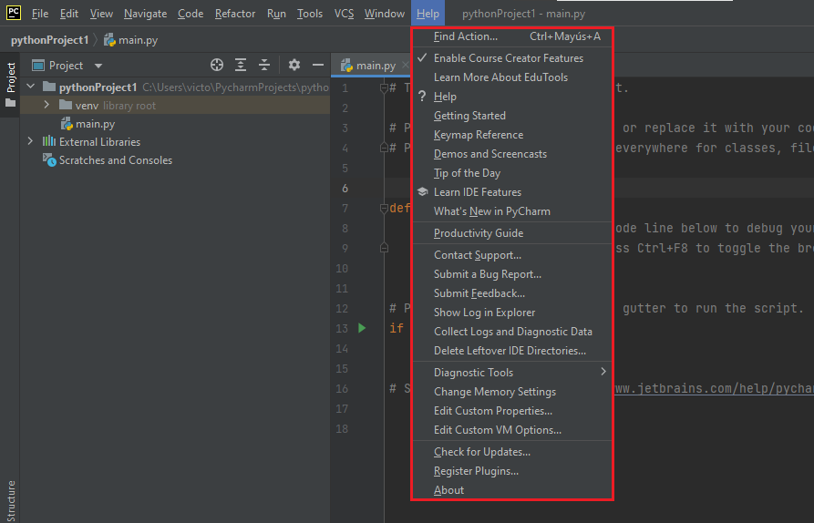

PyCharm es el IDE más popular utilizado para Python. Este capítulo le dará una introducción a PyCharm y explicará sus características, entre las que destacan:

 * ^^Asistencia inteligente a Python^^. Proporciona una finalización e inspección de código inteligente, así como indicaciones de errores y refactorización de código automática.
 * ^^Depuración avanzada^^. 
 * ^^Herramientas científicas^^. Compatible con *Anaconda* y varios paquetes científicos como *matplotlib* y *Numpy*. 
 * ^^Visualización de Git en Editor^^.
 * ^^Desarrollo multitecnología^^. Compatible con JavaScript, SQL y HTML/CSS entre otros.

## **Instalación**

El IDE PyCharm fue creado por la compañía [JetBrains](https://www.jetbrains.com/), y está disponible para los sistemas operativos Windows, Mac y Linux. La ***Community Edition*** es gratuita y contiene todas las funcionalidades necesarias para un uso principiante - intermedio, que serán más que suficientes. La instalación con el asistente no es complicada y requiere 840 MB en el sistema de archivos.

!!! info "ENLACE PYCHARM"

    El siguiente enlace le redirige a la página oficial de JetBrains para la descarga de [PyCharm Community Edition.](https://www.jetbrains.com/es-es/pycharm/download/)

<figure markdown>

  { width="700" height="400" }
   
</figure>

## **Nuevo Proyecto**

Una vez instalado, al iniciar el programa aparece una ventana de bienvenida que ofrece la opción de crear un nuevo proyecto. 

<figure markdown>

  { width="700" height="400" }
    <figcaption>Se puede observar la ruta hasta el archivo: *C:\Users\victo\PycharmProjects\pythonProject\* </figcaption>
</figure>

 - En la parte superior le asigna un nombre y ubicación al nuevo proyecto.
 - Inicialmente, utilice la versión virtual (*virutalenv*). En *Base Interpreter*, seleccione la última versión de Python que tenga disponible para asociarla con el proyecto.
 - Como será su primer proyecto, seleccione la opción *Create a main.py welcome script*, un script de ejemplo que le será de ayuda.
 
<figure markdown>

  { width="700" height="400" }
   
</figure>

## **Herramientas**
Como se puede observar en la imagen anterior, la interfaz se compone de un diseño básico, formado principalmente por los siguientes elementos:
   
   * **^^Editor^^**. La mayor parte de la interfaz estará ocupada por el archivo que desee editar, en el caso de la imagen se observa el código del archivo *main.py*. 
   * **^^Archivos del proyecto^^**. A la izquierda de la pantalla, encontrará los directorios y archivos que componen el proyecto que acaba de crear. Esta ventana es realmente útil, ya que a parte de poder organizar de forma fácil los archivos que crea, haciendo click derecho en el archivo puede realizar diferentes acciones.

<figure markdown>

  { width="650" height="400" }

</figure>

!!! note "Lista desplegable"

    Destacan la posibilidad de crear, mover, ejecutar (*run*), depurar (*debug*) y eliminar archivos. Observe además que en este caso el proyecto contiene un directorio (*venv*), que contiene un único archivo (*main.py*). 

   * **^^Barra de menús^^**. Situada en la parte superior de la interfaz, los diferentes menús que la componen ofrecen una amplia gama de herramientas.
   * ***File***. Permite crear, abrir, guardar y cerrar proyectos o archivos de diferente tipo, modificar las opciones del IDE, activar el modo ahorro de energía o cambiar las propiedades del archivo entre otras opciones.

<figure markdown>

  { width="700" height="400" }

</figure>

   * ***Edit***. Incluye las opciones generales de copiar, cortar, pegar, deshacer, buscar, limpiar, etc. Destacan además las opciones de unir, ordenar o duplicar las líneas de código seleccionadas o todo el código.

<figure markdown>

  { width="700" height="400" }

</figure>

   * ***View***. Orientado principalmente a la configuración del entorno, pudiendo seleccionar los elementos que desea que se muestren u oculten en su interfaz. Además es muy útil poder ver los archivos recientes, así como un historial de las últimas modificaciones en esos archivos. 

<figure markdown>

  { width="700" height="400" }

</figure>

   * ***Navigate***. Distintas opciones de navegación en el código, como la navegación a una línea de código específica, buscar un elemento en el proyecto, encontrar una ruta de archivo... 

<figure markdown>

  { width="700" height="400" }

</figure>

   * ***Code***. Opciones dirigidas principalmente a la escritura/lectura de código, como la inspección y análisis del código, o mover líneas, elementos y enunciados. 

<figure markdown>

  { width="700" height="400" }

</figure>

   * ***Refactor***. La refactorización de código tiene el objetivo de que este pueda leerse de la manera más fácil posible, y que una persona que no haya trabajado en su escritura, pueda captar la lógica de este. Por tanto, esto mejora la legilibilidad y reduce la complejidad, sin realizar cambios en su comportamiento.
    
    Además, incluye las opciones de mover/copiar archivos, la opción *Pull members up*, que ayuda a eliminar el código duplicado; y la opción *Pull members down*, que ayuda a mejorar la coherencia del código.

<figure markdown>

  { width="650" height="400" }

</figure>

   * ***Run***. Sin duda, una de las ventanas que más se emplearán. Desde esta, se pueden realizar tres acciones fundamentales:
     * ^^RUN^^. Opción para ejecutar el programa que se está editando. En el entorno PyCharm encontrará otras formas de realizar esta acción.
     * ^^DEBUG^^. Diseñado para programación, ayuda a agilizar o depurar código, localizando errores o elementos innecesarios.
     * ^^BREAKPOINTS^^. Realiza un punto de parada donde se haya situado el punto al correr el código, de forma que sea posible la revisión. Estos puntos de parada se pueden establecer clickando a la derecha del número de línea en la que se desee poner.

<figure markdown>

  { width="650" height="400" }

</figure>

   * ***Tools***. Puede encontrar distintas opciones relacionadas con la gestión de tareas y contextos e iniciar la consola interactiva de Python. 

<figure markdown>

  { width="650" height="400" }

</figure>

   * ***VCS***. Antes de explicar qué permite esta ventana, hay que entender una serie de conceptos:
     * ^^¿Qué es Git?^^ ^^¿Y GitHub?^^.  **GitHub** es un servicio basado en la nube que aloja un sistema de control de versiones (VCS) llamado **Git**. Este permite a los desarrolladores colaborar y realizar cambios en proyectos compartidos, a la vez que mantienen un seguimiento detallado de su progreso. Todos los usuarios de GitHub pueden rastrear y gestionar los cambios que se realizan en el código fuente en tiempo real, a la vez que tienen acceso a todas las demás funciones de Git. 
     * ^^¿Es importante que conozca GitHub?^^. Como bioquímico interesado en la bioinformática, es muy importante que se familiarice con esta plataforma, ya que hay miles de repositorios disponibles con programas que le pueden resultar útiles, gracias a una gran red de bioinformáticos que comparten sus trabajos y se ayudan mutuamente. 
     
<figure markdown>

  { width="140" height="100" }

</figure>
    
Entendido esto, ya solo queda decir que en esta ventana encontraremos todo lo necesario para vincular nuestro proyecto a GitHub. Podremos elegir si hacer este repositorio público o privado. 

<figure markdown>

  { width="650" height="400" }

</figure>

!!! info "GitHub"

    En el siguiente enlace puede encontrar toda la información acerca de cómo compartir su proyecto en **[GitHub](https://blog.jetbrains.com/idea/2020/11/sharing-your-project-on-github/)**.

   * ***Window***. En esta ventana puede guardar como predeterminada la disposición actual de ventanas o restaurar la disposición original, mostrar el submenú de comandos relacionados con las pestañas del editor o con la realización de tareas en segundo plano, o cambiar entre los proyectos que tenga abiertos. 

<figure markdown>

  { width="650" height="400" }

</figure>

   * ***Help***. Esta es una de las ventanas con más opciones disponibles, entre las que destacan poder obtener más información sobre *PyCharm EduTools*, abrir en archivo [PDF](https://resources.jetbrains.com/storage/products/pycharm/docs/PyCharm_ReferenceCard.pdf) una lista de accesos directos disponibles, sugerencias del día, últimas novedades de PyCharm o buscar las últimas actualizaciones disponibles. 

<figure markdown>

  { width="650" height="400" }

</figure>

   * **Desplegable de abajo**. Por último, mencionar el terminal, python console y paquetes. Aquí hablar de los paquetes disponibles, Anaconda y eso.

