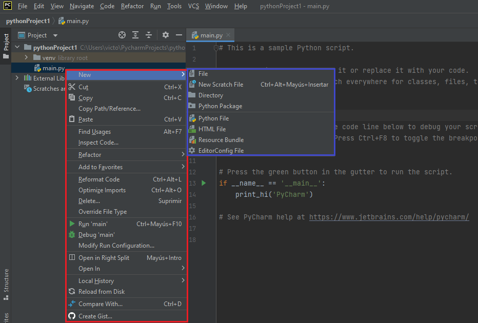

PyCharm es el IDE más popular utilizado para Python. Este capítulo le dará una introducción a PyCharm y explicará sus características, entre las que destacan:

 * ^^Asistencia inteligente a Python^^. Proporciona una finalización e inspección de código inteligente, así como indicaciones de errores y refactorización de código automática.
 * ^^Depuración avanzada^^. 
 * ^^Herramientas científicas^^. Compatible con *Anaconda* y varios paquetes científicos como *matplotlib* y *Numpy*. 
 * ^^Visualización de Git en Editor^^.
 * ^^Desarrollo multitecnología^^. Compatible con JavaScript, SQL y HTML/CSS entre otros.

## **Instalación**

El IDE PyCharm fue creado por la compañía [JetBrains](https://www.jetbrains.com/), y está disponible para los sistemas operativos Windows, Mac y Linux. La ***Community Edition*** es gratuita y contiene todas las funcionalidades necesarias para un uso principiante - intermedio, que serán más que suficientes. La instalación con el asistente no es complicada y requiere 840 MB en el sistema de archivos.

!!! info "ENLACE PYCHARM"

    El siguiente enlace le redirige a la página oficial de JetBrains para la descarga de [PyCharm Community Edition.](https://www.jetbrains.com/es-es/pycharm/download/)

<figure markdown>

  { width="700" height="400" }
   
</figure>

## **Nuevo Proyecto**

Una vez instalado, al iniciar el programa aparece una ventana de bienvenida que ofrece la opción de crear un nuevo proyecto. 

<figure markdown>

  { width="700" height="400" }
    <figcaption>Se puede observar la ruta hasta el archivo: *C:\Users\victo\PycharmProjects\pythonProject\* </figcaption>
</figure>

 - En la parte superior le asigna un nombre y ubicación al nuevo proyecto.
 - Inicialmente, utilice la versión virtual (*virutalenv*). En *Base Interpreter*, seleccione la última versión de Python que tenga disponible para asociarla con el proyecto.
 - Como será su primer proyecto, seleccione la opción *Create a main.py welcome script*, un script de ejemplo que le será de ayuda.
 
<figure markdown>

  { width="700" height="400" }
   
</figure>

## **Herramientas**
Como se puede observar en la imagen anterior, la interfaz se compone de un diseño básico, formado principalmente por los siguientes elementos:
   
   * **Editor**. La mayor parte de la interfaz estará ocupada por el archivo que desee editar, en el caso de la imagen se observa el código del archivo *main.py*. 
   * **Archivos del proyecto**. A la izquierda de la pantalla, encontrará los directorios y archivos que componen el proyecto que acaba de crear. Esta ventana es realmente útil, ya que a parte de poder organizar de forma fácil los archivos que crea, haciendo click derecho en el archivo puede realizar diferentes acciones.

<figure markdown>

  { width="250" height="100" }

</figure>

!!! note "Lista desplegable"

    Destacan la posibilidad de crear, mover, ejecutar (*run*), depurar (*debug*) y eliminar archivos. Observe además que en este caso el proyecto contiene un directorio (*venv*), que contiene un único archivo (*main.py*). 

   * **Barra de menús**. Situada en la parte superior de la interfaz, los diferentes menús que la componen ofrecen una amplia gama de herramientas.
   * *File*. Permite crear, abrir, guardar y cerrar proyectos o archivos de diferente tipo, modificar las opciones del IDE o cambiar las propiedades del archivo entre otras opciones.

<figure markdown>

  { width="700" height="400" }

</figure>

   * *Edit*. Incluye las opciones generales de copiar, cortar, pegar, deshacer, buscar, limpiar, etc. Destacan además las opciones de unir, ordenar o duplicar las líneas de código seleccionadas o todo el código.

<figure markdown>

  { width="700" height="400" }

</figure>

   * *View*. Orientado principalmente a la configuración del entorno, pudiendo seleccionar los elementos que desea que se muestren u oculten en su interfaz. Además es muy útil poder ver los archivos recientes, así como un historial de las últimas modificaciones en esos archivos. 

<figure markdown>

  { width="700" height="400" }

</figure>

   * *Navigate*. Distintas opciones de navegación en el código. 

<figure markdown>

  { width="700" height="400" }

</figure>

   * *Code*. Opciones dirigidas principalmente a la escritura/lectura de código, como la inspección y análisis del código, o mover líneas, elementos y enunciados. 

<figure markdown>

  { width="700" height="400" }

</figure>

   * *Refactor*.

   * *Run*.

   * *Tools*.

   * *VCS*.

   * *Window*.

   * *Help*.

   * **Desplegable de abajo**. Por último, mencionar el terminal, python console y paquetes. Aquí hablar de los paquetes disponibles, Anaconda y eso.

