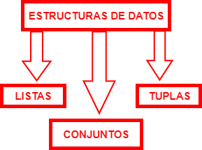

Una **estructura de datos** es una colección de datos (normalmente de tipo simple) que se caracterizan por su organización y las operaciones que se definen en ellos. Por tanto, una estructura de datos vendrá caracterizada tanto por unas ciertas relaciones entre los datos, como las operaciones posibles en ella. 

<figure markdown>

  { width="275" height="150" }

</figure>

## **Listas**
Una **lista** es una colección de elementos en un orden particular, y son el tipo de objeto colección ordenada más flexible en Python, pudiendo albergar objetos de cualquier tipo de datos, como números, cadenas u otras listas anidadas.

En Python, los corchetes ([ ]) indican una lista, y dentro, los elementos individuales se separan por comas. A continuación tiene unos ejemplos de posibles listas.
``` py linenums="1"
numeros = [0,1,2,3,4,5]
diccionario = ['mutación', 'nucleótido']
lista = [0,1,2, 'mutación']
lugar_fecha = [ ['Córdoba', 2022], ['Madrid', 2021] ] 
# El último es un ejemplo de lista que contiene otras listas
```
Si pedimos a Python que imprima por pantalla esta lista, nos devolverá lo siguiente.
``` py
>>> numeros 
[0,1,2,3,4,5]
```
!!! note "Elementos de una lista"

    Tenga en cuenta que al definir una lista se puede hacer referencia a otras variables. Esto será realmente útil.
    ``` py linenums="1"
    cadena_ADN = 'ATAGCGCGCATT'
    num_cromosoma = 14
    lista = [cadena_ADN, num_cromosoma]
    
    >>> lista
    ['ATAGCGCGCATT', 14]
    ```

### ***Acceder a los elementos***
Podemos acceder a cualquiera de los elementos de una lista indicando a Python la posición del elemento deseado. Para ello, escriba el nombre de la lista seguido del índice del elemento entre corchetes.
``` py linenums="1"
lista = ['A','T','G','C']

>>> lista [0]
A
>>> lista [-1]
C
# El orden de los elementos es 0,1,2,3...-3,-2,-1.
```

### ***Cambiar, añadir y eliminar elementos***
Para sustituir un elemento en la lista, use el nombre de la lista seguido del índice del elemento que desea modificar y del nuevo valor que desea.
``` py linenums="1"
celula = ['membrana','nucleo','pared','citosol']

>>> celula [2]
pared

celula[2] = 'organulos'
>>> celula [2]
organulos
```

En lugar de sustituir un elemento, puede interesarle añadir uno nuevo. La forma más sencilla de hacerlo es utilizando el método *append ()*.

``` py linenums="1"
celula = ['membrana','nucleo','pared','citosol']
celula.append('organulos')

>>> celula
['membrana','nucleo','pared','citosol', 'organulos']
```
Como se observa, el elemento *organulos* se añade al final de la lista. Podemos añadir un elemento en cualquier posición con el método *insert ()*. Para esto, habrá que especificar el índice del nuevo elemento y su valor. 
``` py linenums="1"
celula = ['membrana','nucleo','pared','citosol']
celula.insert(0,'organulos')

>>> celula
['organulos', 'membrana','nucleo','pared','citosol']
```

Si en lugar de añadir elementos, desea eliminarlos, hay distintas formas para hacerlo. 

* ^^Sentencia _del_^^. Esta se utiliza para eliminar un elemento en particular, del que conocemos la posición.
``` py linenums="1"
celula = ['membrana','nucleo','pared','citosol']
del celula[2]

>>> celula
['membrana','nucleo','citosol']
```
* ^^Método _remove_^^. Este se utilizará si desconocemos la posición del elemento que deseamos eliminar, solo conocemos su valor.
``` py linenums="1"
celula = ['membrana','nucleo','pared','citosol']
celula.remove("pared")

>>> celula
['membrana','nucleo','citosol']
```
!!! note "Método remove"

    Tenga en cuenta que este método solo eliminará la primera aparición del valor. Si este está repetido en la lista, habrá que utilizar un bucle. Se verá como realizarlo en el siguiente apartado.

* ^^Método _pop ()_^^. Elimina el elemento de una lista, pero permite trabajar con él después de quitarlo. 
``` py linenums="1"
celula = ['membrana','nucleo','pared','citosol']
celula_pop = celula.pop(2)

>>> celula
['membrana','nucleo','citosol']
>>> celula_pop
nucleo
```

### ***Otras funciones***

* ***Count ()***. Este método recibe un elemento como argumento, y cuenta la cantidad de veces que aparece en la lista.
``` py linenums="1"
celula = ['membrana','nucleo', 'membrana', 'membrana', 'pared','citosol']
celula.count("membrana")
3
```
* ***Sort ()***. Este método ordena la lista alfabéticamente.
``` py linenums="1"
celula = ['membrana','nucleo','pared','citosol']
celula_sort()

>>> celula
['citosol','membrana','nucleo','pared']
```

* ***Reverse ()***. Este método invierte el orden original de la lista.
``` py linenums="1"
celula = ['membrana','nucleo','pared','citosol']
celula_reverse()

>>> celula
['citosol','pared','nucleo','membrana']
```

!!! note "Método reverse ()"

    Observe que este método no genera un orden alfabético inverso, simplemente invierte el orden de la lista. Para realizarlo, tendría que utilizar previamente sort (). 

* ***Len ()***. Este método devuelve la longitud de la lista, es decir, el número de elementos que la componen.
``` py linenums="1"
celula = ['membrana','nucleo','pared','citosol']
>>> len(celula)
4
```

* ***min () / max ()***. Este método devuelve el valor mínimo o máximo de una lista.
``` py linenums="1"
edad = [40, 33, 25, 86, 67]
>>> min(edad)
25
```
## **Tuplas**
Las **tuplas** en Python son una colección de varios elementos inmutables separados por comas, del mismo o diferente tipo. 

**¿En qué se diferencia de las listas?** Aparte de la sintaxis, ya que en las listas se utilizan corchetes y en las tuplas ^^paréntesis^^, la principal diferencia entre ambos es que los elementos de una tupla ^^no se pueden cambiar^^ una vez asignados; mientras que los elementos de una lista se pueden cambiar. Por tanto, siempre que necesitemos asegurarnos de que los datos permanezcan sin cambios y protegidos contra escritura, la tupla es la mejor opción.

En Python, los paréntesis () indican una tupla, y dentro, los elementos individuales se separan por comas. A continuación tiene unos ejemplos de posibles tuplas.

``` py linenums="1"
numeros = (0,1,2,3,4,5)
diccionario = ('mutación', 'nucleótido')
tupla = (0,1,2, 'mutación')
```

En realidad no es necesario escribir los paréntesis para indicar que se trata de una tupla, basta con escribir las comas, pero se recomienda escribirlas con paréntesis. Además Python siempre devuelve por salida la tupla con paréntesis.
``` py linenums="1"
tupla = 75, 'nucleótido', 500

>>> tupla
(75, 'nucleótido', 500)
```

!!! note "Trabajar con tuplas"

    La mayoría de funciones disponibles para trabajar con las listas son válidas para trabajar con tuplas. Puede practicar alguno de los ejemplos del apartado anterior con este tipo de estructura.

## **Conjuntos/Set**
Los **conjuntos** o **set** son una estructura de datos utilizada para almacenar elementos de distinto tipo. Estos tienen las siguientes características:

* Los elementos no tienen un orden específico.
* Sus elementos deben ser únicos, por lo que no puede haber elementos duplicados.
* Los elementos son inmutables. Al igual que en las tuplas, no admiten cambios.

**¿Por qué utilizar este tipo de estructura?** A diferencia de las listas, los conjuntos contienen funciones altamente optimizadas con el único propósito de verificar elementos comunes, diferencias entre conjuntos, etc. 

En Python, las llaves ({ }) indican un conjunto, y dentro, los elementos individuales se separan por comas. A continuación tiene unos ejemplos de posibles conjuntos.
``` py linenums="1"
numeros = {0,1,2,3,4,5}
diccionario = {'mutación', 'nucleótido'}
conjunto = {0,1,2, 'mutación'}
```
Al igual que antes, una vez que se crea un conjunto solo podemos añadir y eliminar elementos.

### ***Añadir y eliminar elementos***
Para agregar elementos, tenemos 2 métodos: **add ()** y **update ()**. 
``` py linenums="1"
celula_conjunto = {'membrana','nucleo','pared','citosol'}
celula_conjunto.add('organulos')

>>> celula_conjunto
{'citosol','membrana','organulos','nucleo', 'pared'}
```
``` py linenums="1"
celula_conjunto = {'membrana','nucleo','pared','citosol'}
celula_conjunto.update('organulos')

>>> celula_conjunto
{'pared','organulos','membrana','citosol', 'nucleo'}
```

Para eliminar elementos, tenemos 2 métodos: **remove ()** y **discard ()**.
``` py linenums="1"
celula_conjunto = {'membrana','nucleo','pared','citosol'}
celula_conjunto.remove('nucleo')

>>> celula_conjunto
{'citosol','membrana', 'pared'}
```
``` py linenums="1"
celula_conjunto = {'membrana','nucleo','pared','citosol'}
celula_conjunto.discard('nucleo')

>>> celula_conjunto
{'pared','membrana','citosol'}
```

!!! info "Elementos de un conjunto"

    Observe cómo los elementos no tienen un orden específico dentro del conjunto.

### ***Trabajar con conjuntos***

A continuación se muestran algunas de las funciones más útiles para trabajar con los conjuntos.

| FUNCIÓN | DESCRIPCIÓN | 
|:--:|:--:|
| `clear()`  | Elimina todos los elementos de un conjunto| 
|  `copy()` | Devuelve una copia de un conjunto |   
|  `difference()` |  Devuelve un conjunto que contiene la diferencia entre dos o más conjuntos: los elementos que están en el primero pero no en los demás |   
|  `union()` |  Devuelve un conjunto con todos los elementos que están en alguno de los conjuntos  |   
|  `intersection()`	 |  Devuelve la intersección entre los conjuntos: todos los elementos que están en ambos |   

Veamos un ejemplo del uso de estas funciones.
``` py linenums="1"
conjunto_1 = {3,4,5,6,7,8}
conjunto_2= {6,7,8,9,10}
>>> conjunto_1.intersection(conjunto_2)
{6,8,7}
```

## **Ejercicios**
**EJERCICIO 1**. Escribir un programa que almacene en una lista los 5 tipos principales de bases nitrogenadas, y muestre por pantalla la última.

??? note "Respuesta"
    ``` py linenums="1"
    bases = ["A", "G", "C", "T", "U"]
    print(bases[-1])
    ```
**EJERCICIO 2**. Escribir un programa que almacene en una lista una secuencia nucleotídica n = 10. Muestre por pantalla cuántas "A" aparecen.

??? note "Respuesta"
    ``` py linenums="1"
    secuencia = ['A','C','A','C','T','G','G', 'G', 'A','A']
    print (secuencia.count('A'))
    ```
**EJERCICIO 3**. Escribir un programa que almacene en dos conjuntos secuencias aminoacídicas. Muestre por pantallas los aminoácidos en común.

??? note "Respuesta"
    ``` py linenums="1"
    proteina_1 = {'Trp','Ala', 'Val', 'Ser', 'Trp', 'Gly'}
    proteina_2= {'His','Gly', 'Cys', 'Met', 'Ile', 'Glu'}
    print(proteina_1.intersection(proteína_2))
    ```

**EJERCICIO 4**. Basándose en el código anterior, esta vez cree un nuevo conjunto con todos los aminoácidos que están en al menos uno de los conjuntos.

??? note "Respuesta"
    ``` py linenums="1"
    proteina_1 = {'Trp','Ala', 'Val', 'Ser', 'Trp', 'Gly'}
    proteina_2= {'His','Gly', 'Cys', 'Met', 'Ile', 'Glu'}
    aa_comunes= (proteina_1.union (proteina_2)) 
    print(aa_comunes)
    ```

Puede seguir practicando ejercicios más avanzados de listas en el apartado _Estructuras de control_.


!!! Abstract "DICCIONARIOS"

    Debe conocer que existe un último tipo de estructura de datos conocido como **diccionario**. Un diccionario es una colección de claves - valores en lugar de solo elementos. Cada clave está conectada a un valor, y podemos utilizar esa clave para acceder al valor asociada a la misma. 
    
    En Python, en la sintaxis de los diccionarios se utilizan las llaves ( { } ), presentando la siguiente estructura:
     
    ``` py linenums="1"
    mutaciones = {'nucleotido': 41, 'aminoacido': 'trp' }

    >>>mutaciones['aminoacido']
        trp
    ```
    Como bioquímico principiante en Python, trabajará con las estructuras de datos desglosadas anteriormente, principalmente con las listas. Aun así, si quiere puede obtener más información sobre los diccionarios en el siguiente [enlace](https://realpython.com/python-dicts/). 

!!! cite "Enlaces de interés"

    * [**Ampliación de las estructuras de datos.**](https://docs.python.org/es/3/tutorial/datastructures.html#sets)
    * [**Python Tutorial for Beginners 4: Lists, Tuples, and Sets**](https://www.youtube.com/watch?v=W8KRzm-HUcc)

