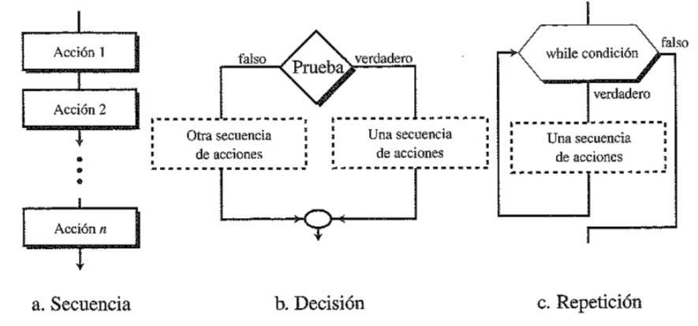

Las **estructuras de control** son aquellas que permiten modificar el flujo normal de ejecución de instrucciones de un programa, dependiendo del resultado de unas condiciones.

Estas estructuras nos permiten realizar acciones típicas en nuestros scripts, como pueden ser bucles o la toma de decisiones.

<figure markdown>

  { width="700" height="500" }
   <figcaption> Lógica de Programación. Universidad Politécnica de Puebla (UPP). </figcaption>

</figure>

## **Bucles FOR**

Un **bucle** es una estructura de control que repite un bloque de instrucciones, denominado _cuerpo_, siendo cada repetición conocida como _iteración_. En el caso del **bucle for**, se repite el bloque de instrucciones un número determinado de veces.

Los bucles nos permiten realizar las mismas acciones con los elementos de una lista, como puede ser realizar una misma operación matemática con cada elemento.

### ***Sintaxis***

Si tiene una lista con diferentes elementos, como distintos tipos de proteínas, y quiere imprimir por pantalla todos los nombres, puede hacerlo de forma individual como ya se enseñó anteriormente. Esto nos conduce a los siguientes problemas:

* Código muy repetitivo.
* Trabajo lento y poco eficiente.
* Cada vez que se altere la longitud de la lista, cambiar el código.

Por este motivo, utilizaríamos la siguiente estructura.

``` py
>>> proteinas = ['hemoglobina','caseina','lacasa','albumina']
>>> for proteina in proteinas:
...     print (proteina)
```
En este caso, se ha definido la lista *proteinas*, y el bucle for le indica a Python que cada elemento de esta lista se asocie con la variable *proteina*. Posteriormente, se indica que imprima cada elemento que se ha ido asignando a la variable *proteina*. La salida será la siguiente:
``` py
hemoglobina
caseina
lacasa
albumina
```
Por tanto, Python va imprimiendo el valor actual de la variable *proteina*, que va cambiando al repetir el bucle. Cuando ya no hay más elementos en la lista, finaliza el programa. 

!!! info "Nomenclatura de la variable"

    Tenga en cuenta que puede elegir el nombre que quiera para la variable temporal. Se ha elegido en este caso *proteina* porque conviene utilizar nombres significativos, que representen los elementos de la lista. 

Es muy importante tener cuidado con las líneas sangradas. A veces, el bucle se puede ejecutar sin problemas pero que no produzca el resultado esperado. Veamos algunos ejemplos de esto:
``` py
>>> proteinas = ['hemoglobina','caseina','lacasa','albumina']
>>> for proteina in proteinas:
...     print (f"La {proteina} es una proteína.")
>>> print (proteina)
```
Este código imprime por pantalla el siguiente texto. Observe cómo en la última línea de código, únicamente se muestra el último elemento asociado a la variable *proteina*.
``` py
La hemoglobina es una proteína.
La caseina es una proteína.
La lacasa es una proteína.
La albumina es una proteína.
albumina
```


## **Condicional IF**

d

## **Bucles WHILE**

dd


