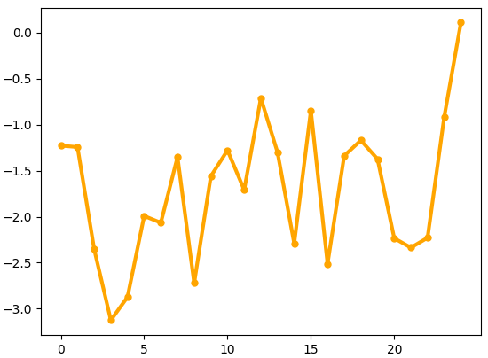
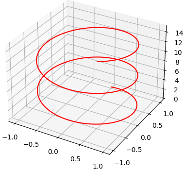

Para hacer gráficas en Python existen una gran cantidad de librerías disponibles, como _Numpy_, vista anteriormente para el tratamiento de datos. Aunque hay un amplio abanico de opciones, sin duda la más utilizada por todo el ámbito científico es ***matplotlib***. 

## **¿Qué es matplotlib?**
[Matplotlib](https://matplotlib.org/) es una biblioteca completa para crear visualizaciones estáticas, animadas e interactivas en Python. Aunque con el tiempo ha sido superada visualmente por otras librerías más atractivas e interactivas ([seaborn](https://seaborn.pydata.org/) o [ggplot2](https://ggplot2.tidyverse.org/)), el conocimiento y empleo de esta librería sigue siendo el más extendido.

El paquete _matplotlib_ es relativamente grande y complejo, y entre otros contiene dos módulos principales: ***pyplot*** y ***pylab***.

* ^^pyplot^^. Esta interfaz generalmente se prefiere para la graficación no interactiva (es decir, secuencias de comandos).
* ^^pylab^^. Esta interfaz es conveniente para cálculos y graficación interactiva, ya que minimiza la escritura. Utiliza funcionalidades combinadas de _pyplot_ y _NumPy_.

### ***Instalación***
En primer lugar debe instalar el paquete _matplotlib_. Para ello, como se explicó en el apartado [PyCharm](3_Pycharm.md), vaya a la ventana de _Python Packages_ e instálelo.

<figure markdown>

  { width="800" height="500" }
    <figcaption> Instalación del paquete *matplotlib* </figcaption>
</figure>

Otra opción sería utilizar el siguiente comando en la consola:
```
pip install matplotlib
```
### ***Importación***
Para usar la interfaz de _matplotlib_ existen dos formas posibles, en función del módulo que desea emplear:
``` py linenums="1"
#Para importar el módulo pylab
from pylab import * 

#Para importar el módulo pyplot
import matplotlib.pyplot as plt
```
En nuestro caso vamos a utilizar el módulo _pyplot_, así que debe utilizar la última forma. En el tutorial se va a omitir la importación del módulo para evitar la repetición constante, aunque no olvide que es fundamental.

## **Creación de figuras**
### ***Función plot***
La función más simple para crear una figura es la **función plot**. Esta crea de forma automática la figura y el conjunto de ejes, representando los datos utilizados como argumentos. 
``` py linenums="1"
x = [1,3,5,7]
y = [1,5,10,15]
plt.plot(x,y)
plt.show()
```
<figure markdown>
  { width="400" height="400" }
</figure>

Como puede observar, esta función recibe un conjunto de valores **x** e **y**, y los muestra en una figura de líneas. 

Al final del argumento es fundamental utilizar la función **plt.show()** para que el resultado se muestre como una imagen, que la aparecerá en una ventana diferente de PyCharm.

Si desea mostrar en una misma figura varias gráficas, debe utilizar la función plot las veces que sean necesarias antes que la función show. Veamos un ejemplo:
``` py linenums="1"
x = [1,3,5,7]
y = [1,5,10,15]
a = [1,3,5,7]
b = [3,6,2,5]
plt.plot(x,y)
plt.plot(a,b)
plt.show()
```
<figure markdown>
  { width="400" height="400" }
</figure>


!!! note "Datos aleatorios"

    Para practicar en la creación de gráficas, lo mejor es utilizar una serie de datos aleatorios. Para esto puede utilizar NumPy de la siguiente forma:
    ``` py linenums="1"
    import numpy as np
    x = np.random.randn(25).cumsum() #25 números aleatorios del 0 al 25
    # Al asignar solo el eje x, se asigna un conjunto aleatorio a y.
    ```
#### ***Formato a la gráfica***
Para modificar el estilo de las líneas de la gráfica utilice el parámetro **linestyle**. Como ha visto, por defecto es una línea continua, aunque puede cambiarlo por ejemplo por una línea discontinua:
``` py linenums="1"
x=np.random.randn(25).cumsum()
plt.plot(x, linestyle= "--")
plt.show()
```
<figure markdown>
  { width="400" height="400" }
</figure>

En el argumento, en lugar de utilizar "--" pruebe otros como "-.", "dashdot", ".", "dotted". 

También puede modificar el ancho de las líneas con el parámetro **linewidth**, mostrar los puntos que unidos por líneas con el parámetro **marker** y modificar el tamaño de estos puntos con el parámetro **markersize**. 
``` py linenums="1"
x=np.random.randn(25).cumsum()
plt.plot(x, linewidth=3, marker = "o", markersize= "7")
plt.show()
```
<figure markdown>
  { width="400" height="400" }
</figure>

Existen una gran cantidad de marcadores posibles en lugar del clásico punto. Puede encontrar una lista en el siguiente [enlace](https://matplotlib.org/stable/api/markers_api.html).

!!! info "Personalización del marcador"

    Al igual que markersize, existen una serie de parámetros que permiten modificar el marcador. Si le interesa, busque información acerca de la función y empleo de estos parámetros.

    Destacan: **markeredgewidth**, **markeredgecolor** y **markerfacecoloralt**. 

A estas alturas del apartado, seguro que se ha preguntado cómo cambiar el color de las gráficas. El parámetro **color** es el utilizado para esto, y admite varios formatos:

* Utilizar el ^^nombre^^: "blue", "orange", "green"...
* Utilizar el ^^carácter^^ asociado al color: "b", "o", "g"...
* Utilizar la ^^cadena de texto^^ asociado al color: "FF0000", "008000"...
* [Color web](https://en.wikipedia.org/wiki/Web_colors).

``` py linenums="1"
x=np.random.randn(25).cumsum()
plt.plot(x, linewidth=3, color="red")
plt.show()
```
<figure markdown>
  { width="400" height="400" }
</figure>

Como sabe, es fundamental que una gráfica muestre una leyenda indicando qué representa. Para ello debe utilizar el parámetro **label** y la función **legend**:
``` py linenums="1"
x=np.random.randn(25).cumsum()
plt.plot(x, color ="blue", label="Gráfica 1")
plt.legend()
plt.show()
```
<figure markdown>
  { width="400" height="400" }
</figure>

Con la función plot se crean tanto una figura como un conjunto de ejes, aunque la función no nos permite personalizarlos. Como alternativa a esta función, existe una función que permiten mayor grado de personalización y que es combinable con la función plot:

* [Función subplots](https://matplotlib.org/3.5.0/api/_as_gen/matplotlib.pyplot.subplots.html).

### ***Función subplots***
La **función subplots** devuelve una referencia a la figura y al conjunto de ejes, creando por defecto un único conjunto de ejes si no se especifica. Veamos cómo se emplea esta función:
``` py linenums="1"
x=np.random.randn(25).cumsum()
fig, ax = plt.subplots(2,2) #Indicamos una matriz de 2 filas y 2 columnas
plt.show()
```
<figure markdown>
  { width="400" height="400" }
</figure>

De esta forma se han creado cuatro conjuntos de ejes (una matriz 2x2). Ahora podríamos utilizar la función _plot_ asociada a cada uno de estos ejes de forma independiente:
``` py linenums="1"
x=np.random.randn(25).cumsum()
fig, ax = plt.subplots(2,2, sharey=True, sharex=True)
ax[1,0].plot(x) #Se representa en la fila 2 columna 1.
plt.show()
```
<figure markdown>
  { width="400" height="400" }
    <figcaption> Las funciones **sharey** y **sharex** en True indican que todos los conjuntos compartan los mismos ejes </figcaption>
</figure>

#### ***Formato a la figura***

* ***Título***. Para insertar un título a la figura se utiliza la **función title**. 

``` py linenums="1"
x=np.random.randn(25).cumsum()
fig, ax = plt.subplots()
ax.plot(x, linewidth=3, color="red", label="Gráfica 1")
plt.legend()
plt.title("Título de ejemplo")
plt.show()

```
<figure markdown>
  { width="400" height="400" }
</figure>

Este título permite un amplio grado de personalización, consulte el siguiente [enlace](https://matplotlib.org/stable/api/_as_gen/matplotlib.pyplot.title.html) para obtener más información. 
``` py linenums="1"
x=np.random.randn(25).cumsum()
fig, ax = plt.subplots()
ax.plot(x, linewidth=2, color="black", marker="o", markersize =5)
plt.title("TÍTULO",position=(0.1,0.85), color="blue", fontsize=25, fontweight="bold")
plt.show()
```
<figure markdown>
  { width="400" height="400" }
</figure>

* ***Etiquetas de ejes***. Para añadir etiquetas a los ejes utilice la **función xlabel** y **función ylabel**.

``` py linenums="1"
x=np.random.randn(25).cumsum()
fig, ax = plt.subplots()
ax.plot(x, linewidth=3, color="blue", marker="o", markersize =5)
plt.title("Título de ejemplo")
plt.xlabel("Título eje X", color="black", fontweight="bold")
plt.ylabel("Título eje Y", color="black", fontweight="bold")
plt.show()
```
<figure markdown>
  { width="400" height="400" }
</figure>

Estas funciones nos permiten utilizar atributos adicionales similares a los utilizados en la _función title_.

* ***Marcas de ejes***. Existen diferentes formas de cambiar los valores de los ejes. Una de las más útiles es la **función xticks** y **función yticks**.

``` py linenums="1"
x=np.random.randn(25).cumsum()
fig, ax = plt.subplots()
ax.plot(x, linewidth=3, color="orange", marker="o", markersize =5)
plt.xticks(range(0,25,5))
#Se ha limitado el eje X de 0 hasta 25, con saltos de 5 unidades.
plt.show()
```
<figure markdown>
  { width="400" height="400" }
</figure>

!!! info "Marcas de los ejes"

    Otra función muy utiilzada para cambiar los valores de los ejes es la **función lim**. Puede buscar información acerca de ella, aunque se utiliza de forma muy similar a la *función ticks*.

* ***Grid/Rejilla***. En muchas ocasiones necesitará mostrar la rejilla en la figura para que sea más fácil la visualización de los datos. Para ello utilice la **función grid**.

#### ***Ejemplo resumen***
A continuación se muestra un ejemplo que combina la mayoría de los elementos vistos hasta el momento.
``` py linenums="1"
x=np.random.randn(25).cumsum()
y=np.random.randn(25).cumsum()
fig, ax = plt.subplots()
ax.plot(x, linewidth=1, color="blue", marker="o", markersize =4, label="Figura 1")
ax.plot(y, linestyle="dotted", linewidth=2, color="red", label="Figura 2")
plt.title("Gráfica 1", color="black", fontsize=15, fontweight="bold")
plt.xlabel("Título eje X", color="black", fontsize=12, fontweight="bold")
plt.ylabel("Título eje Y", color="black", fontsize=12, fontweight="bold")
ax.grid()
plt.legend()
plt.show()
```
<figure markdown>
  { width="500" height="500" }
</figure>

### ***Otras figuras***
Hasta el momento se ha trabajado con figuras de líneas, aunque _Matplotlib_ permite trabajar con muchas más figuras. Tenga en cuenta que muchos de los atributos y parámetros vistos hasta el momento con la _función plot_ se emplean del mismo modo.

* ***Scatter/Dispersión***. Para crear un gráfico de dispersión utilice la **función scatter**.

``` py linenums="1"
x=np.random.randn(25).cumsum()
y=np.random.randn(25).cumsum()
fig, ax = plt.subplots()
ax.scatter(x, y, linewidth=1, color="red", marker="o")
plt.title("Gráfico de dispersión", color="black", fontsize=15, fontweight="bold")
ax.grid()
plt.show()
```
<figure markdown>
  { width="400" height="400" }
</figure>

* ***Áreas***. Para crear un gráfico de áreas utilice la **función fill_between**.

``` py linenums="1"
x=[1,2,3,4]
y=[1,2,0,2]
fig, ax = plt.subplots()
ax.fill_between(x, y, linewidth=1, color="red")
plt.title("Diagrama de áreas", color="black", fontsize=15, fontweight="bold")
plt.show()
```
<figure markdown>
  { width="400" height="400" }
</figure>

* ***Barras***. Para crear un gráfico de barras utilice la **función bar**.

``` py linenums="1"
x=[1,2,3,4]
y=[1,2,7,5]
fig, ax = plt.subplots()
ax.bar(x, y, linewidth=1, color="red")
plt.title("Diagrama de barras", color="black", fontsize=15, fontweight="bold")
plt.show()
```
<figure markdown>
  { width="400" height="400" }
</figure>

!!! note "Diagrama de barras"

    Si desea un diagrama de barras horizontales en lugar de verticales, uticile la **función barh** de forma similar a la *función bar*.

* ***Histograma***. Para crear un histograma utilice la **función hist**. Dentro de un histograma, hay diferentes parámetros interesantes a modificar: 
    * _bins_: modificar el número de barras de nuestro histograma.
    * _range_: controla los valores mínimos y máximos en el histograma. 
    * _orientation_: puede tomar los valores _horizontal_ o _vertical_, y determina la orientación del histograma.

``` py linenums="1"
x=np.random.randn(1000).cumsum()
fig, ax = plt.subplots()
ax.hist(x, color="red", bins = 10, range=(-5,5), orientation="horizontal")
plt.title("Histograma", color="black", fontsize=15, fontweight="bold")
plt.show()
```
<figure markdown>
  { width="400" height="400" }
</figure>

* ***Diagrama de sectores***. Para crear un diagrama de sectores utilice la **función pie**. Al igual que en el histograma, existen parámetros que debe manejar:
    * Labels. Asocia los sectores a sus etiquetas correspondientes. 
    * Autopct. Muestra los porcentajes representados por cada sector.
    * Pctdistance. Distancia del número al centro del gráfico.
    * Colors. Permite especificar los colores de los sectores.

``` py linenums="1"
x = [5,3,10,8]
nombre = ["Primero", "Segundo", "Tercero", "Cuarto"]
fig, ax = plt.subplots()
ax.pie(x, labels=nombre, autopct="%1.1f%%", pctdistance=0.5)
plt.title("Diagrama sectores", color="black", fontsize=15, fontweight="bold")
```
<figure markdown>
  { width="350" height="350" }
</figure>

* ***Mapa de colores***. Para crear un mapa de colores a partir de una matriz utilice la **función imshow**.

``` py linenums="1"
x=np.random.random((15,15))
#Observe cómo cambia la entrada para obtener la matriz
fig, ax = plt.subplots()
ax.imshow(x)
plt.title("Mapa de color", color="black", fontsize=15, fontweight="bold")
plt.show()
```
<figure markdown>
  { width="350" height="350" }
</figure>

## **Exportación de gráficas**
Después de crear las figuras, Python nos permite diferentes modos para poder guardarlas:

* **Desde PyCharm**. Como habrá observado, en todas las salidas de imagen aparece un botón para poder guardar las figuras.
* **savefig()**. Desde la propia línea de comandos se puede guardar la imagen en el directorio de trabajo o en otro directorio específico:

``` py linenums="1"
#Para guardar la figura en el directorio de trabajo
plt.savefig("Figura_1.png")
#Para guardar la figura en otro directorio
plt.savefig("C:/Ruta/Figura_1.png")
```

* **imsave()**. Se usa de forma similar al anterior. ***Indica si hay alguna diferencia de comportamiento respecto al anterior***


## **Gráficas avanzadas**
Las figuras vistas hasta el momento son figuras 2D, aunque _matplotlib_ nos permite también crear figuras 3D. A continuación se muestra un ejemplo de este tipo de gráficas, de las que puede profundizar en el siguiente [enlace](https://matplotlib.org/2.0.2/mpl_toolkits/mplot3d/tutorial.html#surface-plots).
``` py linenums="1"
import matplotlib.pyplot as plt
import numpy as np
from mpl_toolkits import mplot3d
#Este submódulo permite crear los ejes 3D
fig = plt.figure() #Creación de la figura
ax = plt.axes(projection="3d") #Creación de los ejes
plt.show()
```
<figure markdown>
  { width="350" height="350" }
</figure>

``` py linenums="1"
import matplotlib.pyplot as plt
import numpy as np
from mpl_toolkits import mplot3d
fig = plt.figure()
ax = plt.axes(projection="3d") 

#Datos para crear una gráfica de dispersión
x = np.random.normal(10, 100, 500)
y = np.random.normal(10, 100, 500)
z = np.random.normal(10, 100, 500)
scatter = ax.scatter3D(x,y,z)
plt.show()
```
<figure markdown>
  { width="350" height="350" }
</figure>

``` py linenums="1"
import matplotlib.pyplot as plt
import numpy as np
from mpl_toolkits import mplot3d
fig = plt.figure()
ax = plt.axes(projection="3d") 

#Datos para crear una gráfica de líneas
z = np.linspace(0, 15, 1000) #Esta función genera un array Numpy entre 0 y 15 con 1000 números
#Puede informarse acerca de la función linspace() y logspace()
x = np.sin(z)
y = np.cos(z)
ax.plot3D(x, y, z, "red")
plt.show()
```
<figure markdown>
  { width="350" height="350" }
</figure>

## **Ejercicios**
En este apartado de ejercicios le vamos a introducir los **cuadernos de Python**. 

Como viene utilizando hasta el momento, la forma tradicional de crear un programa en Python es crear un archivo _.py_ que almacene el código fuente de dicho programa. En este caso, en lugar de utilizar esto utilizaremos un cuaderno de [Google colab](https://colab.research.google.com/).

Los cuadernos en lenguaje de programación (normalmente conocidos como ^^notebook^^) permiten combinar texto y código, siendo muy útiles para documentar nuestro trabajo a la vez que probamos código fácilmente. Otro de los cuadernos más utilizados en Python es [Jupyter Notebook](https://jupyter.org/). 

A continuación puede acceder a los ejercicios que se le plantean: [Google Colab Notebook](https://colab.research.google.com/drive/1MV_PKIMXun1RKmETiMxVLcoJ6R2rMRkS?usp=sharing). 


!!! cite "Enlaces de interés"

    * [**Información acerca de Matplotlib.**](https://matplotlib.org/3.5.1/users/index.html)
    * [**Matplotlib.** John Hunter & the development team (2021).](https://matplotlib.org/Matplotlib.pdf)
    * [**Información acerca de la graficación 3D.**](https://matplotlib.org/2.0.2/mpl_toolkits/mplot3d/tutorial.html)
    * [**Python Graphics: A Reference for Creating 2D and 3D Images**. B.J. Korites (2018).](https://www.pdfdrive.com/python-graphics-a-reference-for-creating-2d-and-3d-images-e196900299.html)


