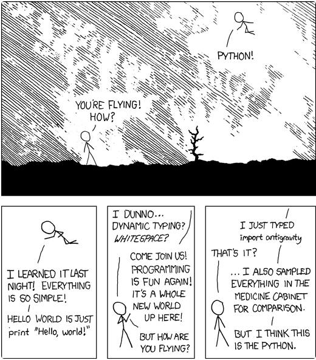

Este tutorial de programación ha sido desarrollado por Víctor J. Fernández Ramírez como Trabajo de Fin de Grado de la titulación de [Grado de Bioquímica](https://www.uco.es/ciencias/es/grado-bioquimica) en la [Universidad de Córdoba](https://www.uco.es/), y dirigido por el profesor [Manuel J. Marín Jiménez](http://www.uco.es/~in1majim/). 

<figure markdown>

  { width="400" height="350" }

</figure>
